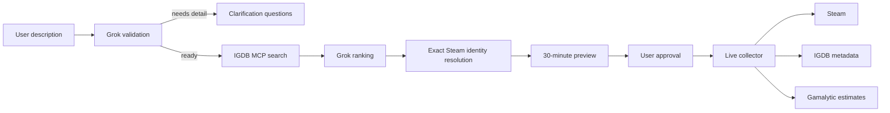

# Backend architecture

The backend is a stateless live collector with one deliberately temporary state boundary: pending discovery previews. It runs in the Next.js Node runtime because the MCP SDK, OAuth handling, and in-process coordination require server-only modules.

Discovery and collection are separate request lifecycles. The first request returns compact candidates. The second request claims the stored preview and collects only its approved AppIDs.

Provider result caches are disabled. Request gates and the short-lived IGDB OAuth token are process-local coordination state. Pending previews are also process-local, bounded to 100 records, and expire after 30 minutes.

The architecture favors explicit partial results. A missing optional provider adds an issue to a game. An invalid Steam app becomes a per-game failure. A failure affecting the entire discovery stage returns a sanitized API error.
