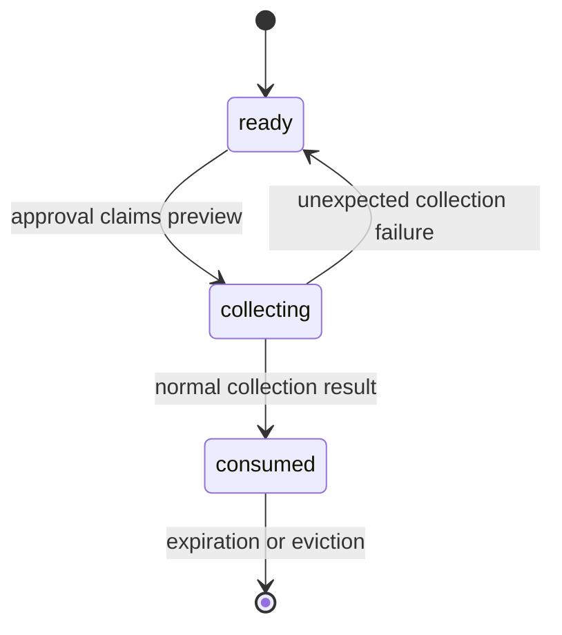

# Pending preview lifecycle

A ready preview is stored in a process-local `Map` keyed by a random UUID. The record contains the original query, validated intent, compact candidates, timestamps, and lifecycle state. It does not contain collected prices, reviews, comments, or estimates.

Records expire 30 minutes after creation. Expired records are removed during normal store operations. Capacity is limited to 100 records; when capacity is reached after pruning, the oldest remaining record is evicted.

A record moves through three states:

Claiming is synchronous and atomic within one Node process. A second caller receives `PREVIEW_BUSY` while collection runs and `PREVIEW_CONSUMED` afterward.

Process restarts erase all previews. Separate instances do not share memory, so production horizontal scaling requires sticky routing or a future shared store implementing the same create, get, claim, release, and complete operations.
